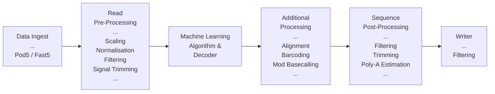

# Basecaller

Click [here](https://nanoporetech.com/platform/technology/basecalling) for an introduction of how
nanopore sequencing and basecalling works.

## Basecalling Pipeline

Dorado is the Oxford Nanopore basecaller. Basecalling is the process of calling nucleotide bases (ACGT) from
a nanopore signal which is recorded from your sequencing device. This signal data is stored
in POD5 or FAST5 files, although support for the FAST5 file format has been deprecated.

There are many parts of the basecalling process many of which we will explain in this document.

---

## Data Ingest

!!! warning inline end "FAST5 file support is deprecated"

Reads are sourced from POD5 and FAST5 files.

`-n / --max-reads N` - Basecall only `N` reads

`-l / --read-ids FILE` - Basecall only reads in `FILE`. This read ids file should contain newline delimited read ids only.

`-r / --recursive` - Consider all POD5 **or** FAST5 files in `data` and all subdirectories.

---

## Signal Pre-Processing

The signal chunk pre-processing stage takes raw signal chunks from their source and performs some
manipulations to improve basecalling accuracy.

Signal scaling aims to bring raw signal values into a consistent regime to improve the
performance of the machine learning algorithm using during basecalling.
The scaling strategies used are pico-Ampere (PA) scaling with and
without standardisation, quantile scaling and median absolute deviation (medmad) scaling.
The scaling strategy used depends on the how the basecalling model was trained and as such
the scaling strategy selection is controlled by the model configuration file. Note that scaling is
performed on the whole read before trimming.

!!! note inline end "DNA Rapid Adapter Trimming is Disabled"

In the trimming stage, RNA adapters and DNA **rapid adapters*** are detected the signal
and their position is recorded.

The very beginning of a nanopore sequencing read often contains samples that are far out of
the normal distribution and as such we try to remove these samples in **DNA reads only**
by detecting the first samples of useful data.

Finally, if any signal trimming is required it is actioned.

---

## Machine Learning Algorithm

The machine learning algorithm is at the core of the basecalling process. These incredibly accurate
and efficient models can decode the sequencing signal to produce nucleotide base calls.
The machine learning model predicts the probabilities of each base being present throughout the
signal. These probabilities are then decoded to determine the most likely sequence of bases which
is then emitted as the output of the algorithm.

There have been many version of basecalling models with improvements to model architecture and
training data to improve upon the basecalling speed and accuracy over time. The basecalling model
is set by the user and is normally one of `fast`, `hac` (high-accuracy), and `sup` (super-accurate).

More details can be found in the dedicated [models documentation]({{find("models")}}).

??? Info "Advanced Basecalling Controls"

    Here are the advanced basecalling parameters available to the user:

    !!! Warning inline end

        We generally **do not recommend** users set the arguments listed here unless absolutely necessary.

        The default values are often good for most users however if you're facing issues
        please read the [troubleshooting guide]({{find("troubleshooting")}}).

    `--batchsize SIZE` - The batch size controls the number of signal chunks passed the the model at once.
        This can be thought of as the number of rows in a table. Often, increasing the
        batch size results in better overall throughput especially on
        modern GPU hardware. However, this comes at the cost of increases memory usage
        which is limited. Dorado will use a default batchsize if one is has been computed for the
        system hardware.

    `--chunksize SIZE` - The chunk size controls the number of signal samples that are passed to the model
        in a single chunk. This can be thought of as the length of each row in a table.
        Increasing the chunk size can improve throughput with the typical cost of increased memory usage.
        Changing the chunk size can change the output sequence as the chunk stitching algorithm
        which handles long sequences spanning multiple overlapping chunks is not perfect.

    `--overlap SIZE` - The overlap value controls number of samples that are overlapping between chunks.
        Increasing this value decreases throughput as more samples will be basecalled twice. However, this
        value is critical in ensuring that chunks are stitched accurately.

---

## Additional Processing

### Alignment

Please see [alignment]({{find("alignment")}}) for details.

### Barcoding

Please see [barcoding]({{find("barcoding")}}) for details.

### Modified Basecalling

Please see [modified basecalling]({{find("mods")}}) for details.

---

## Sequence Post-Processing

The sequence post-processing stage includes a number of stages depending on the options selected.

### Read Trimming

Please see [read trimming]({{find("read_trimming")}}) for details.

### Read Splitting

Please see [read splitting]({{find("read_splitting")}}) for details.

### PolyA Estimation

Please see [poly-a estimation]({{find("polya_estimation")}}) for details.

---

## File Writer

See the [Dorado SAM file specification]({{find("sam_spec")}}) for details on the SAM / BAM output
generated by dorado.

BAM is the default file format written by `dorado basecaller` however SAM and FASTQ file formats
can be selected. The content of the BAM and SAM files will be identical but the metadata
content in the FASTQ file will differ some of the metadata tags are not supported.

By default, the output file is written to `stdout`. This process is summarised in the
getting started help for [redirecting output]({{find("index")}}#redirecting-output) but
the output can be written directly to files using the `-o / --output-dir` argument.

`--emit-sam` - This flag sets the output file format to be SAM.

`--emit-fastq` - This flag sets the output file format to be FASTQ.

`--emit-moves` - This flag will write the [move table]({{find("move_table")}}) into the SAM / BAM outputs.

`-o / --output-dir DIR` - This optional argument can be used to specify an output directory using
    the filename template `calls_<timestamp>.(sam|bam|fastq)`

---
